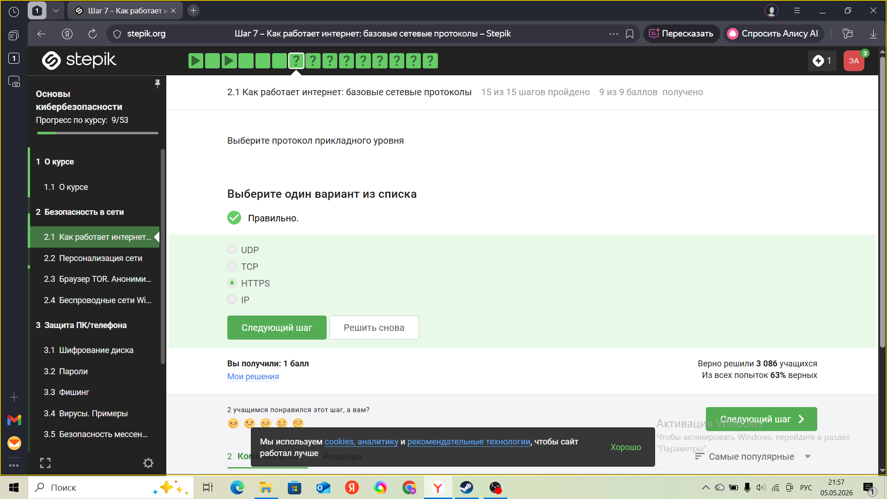
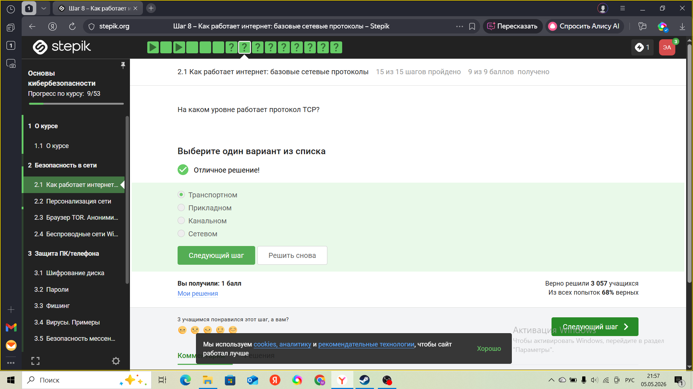
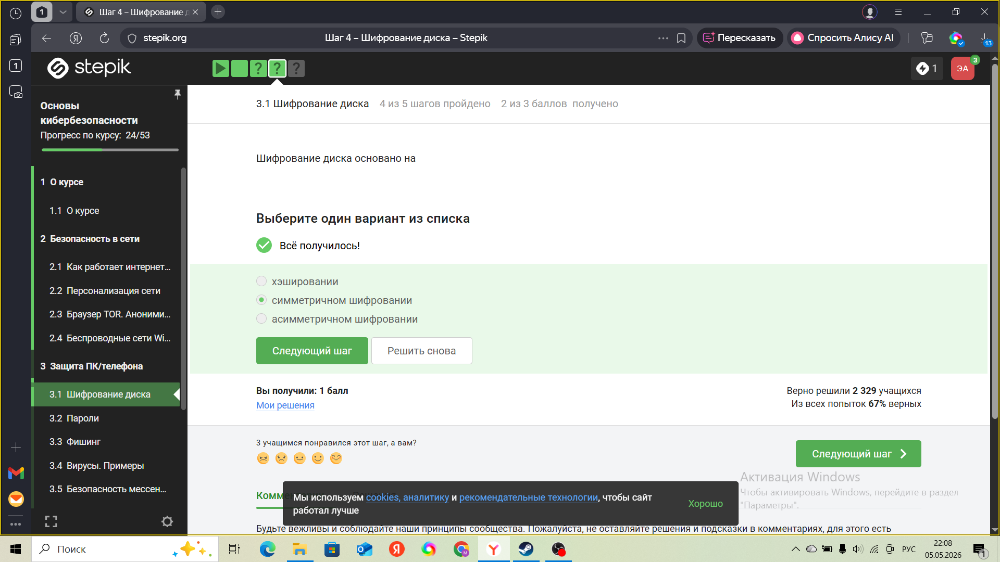
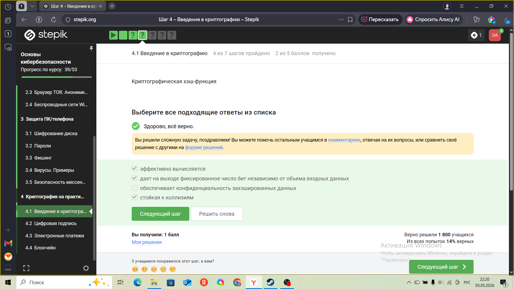

---
## Front matter
lang: ru-RU
title: Презентация по прохождению курса Основы кибербезопасности
subtitle: курс
author:
  - Агджабекова Эся Рустамовна
institute:
  - Российский университет дружбы народов, Москва, Россия
date: 14 мая 2026

## i18n babel
babel-lang: russian
babel-otherlangs: english

## Formatting pdf
toc: false
slide_level: 2
aspectratio: 169
section-titles: true
theme: metropolis
header-includes:
 - \metroset{progressbar=frametitle,sectionpage=progressbar,numbering=fraction}
---

# Цель работы

пройти курс

# Ход выполнения работы

## Тест по теме Безопасность в сети .
  
   { #fig:001 }

## Тест по теме Безопасность в сети .
  
   { #fig:002 }

## Тест по теме Защита ПК/телефона.
  
   { #fig:022  }

## Тест по теме Защита ПК/телефона.
  
   { #fig:023  }

## Тест по теме Криптография.
  
   { #fig:036 }

## Тест по теме Криптография.
  
   { #fig:037 }

## Завершение курса.
 
   ){ #fig:050 }

# Заключение
Я успешно прошла курс по основам кибербезопасности.

